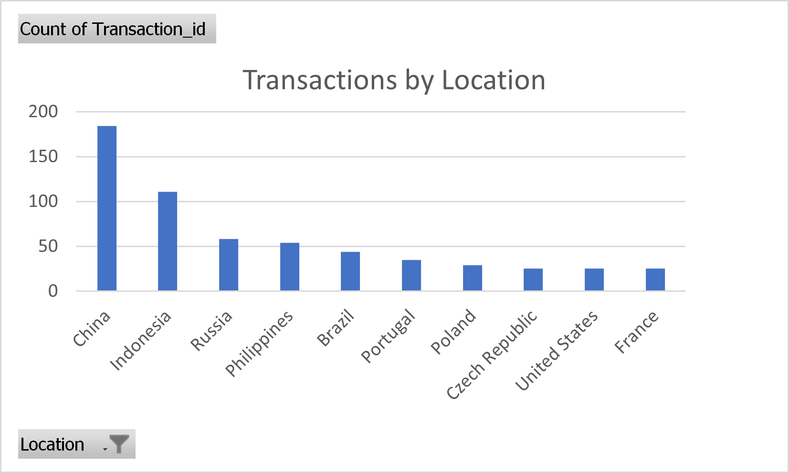
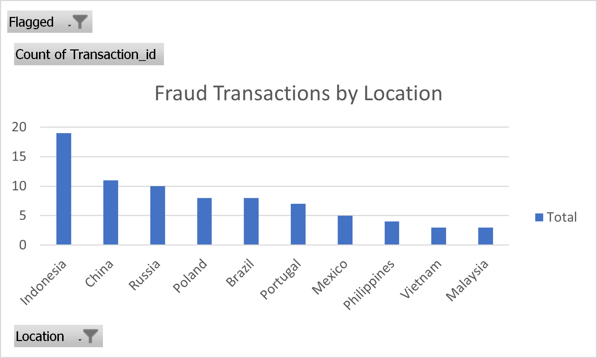
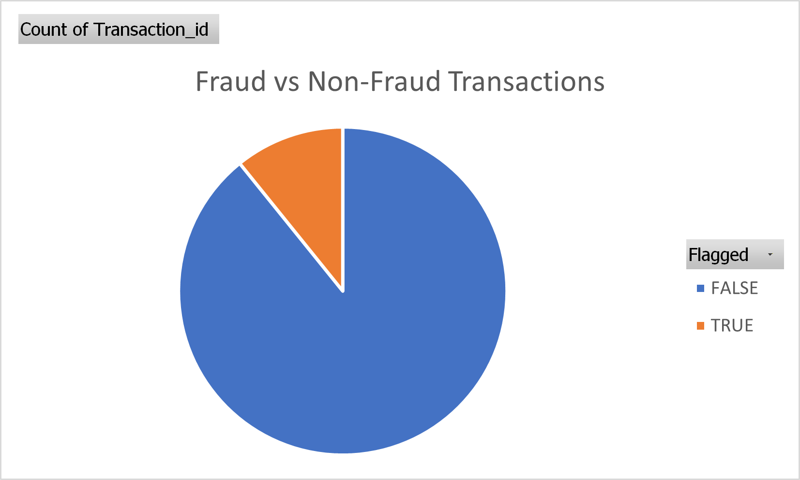
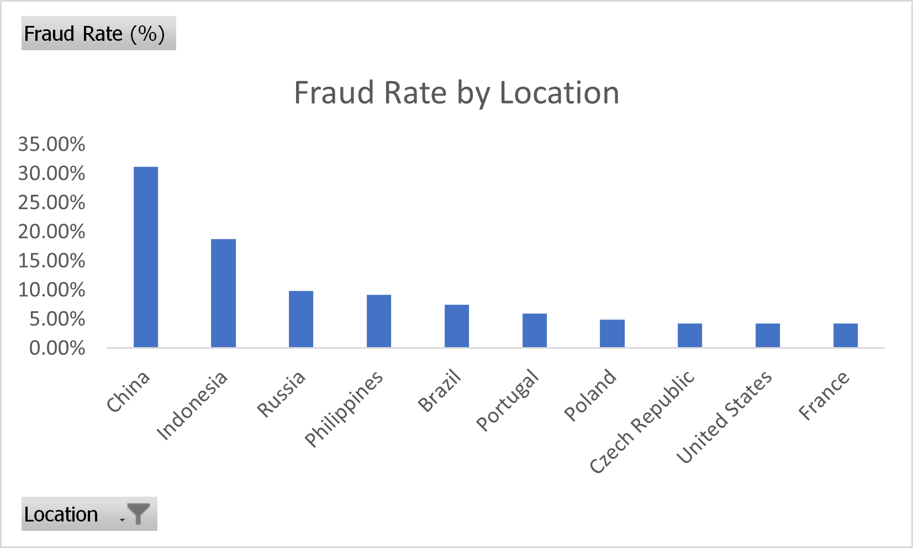
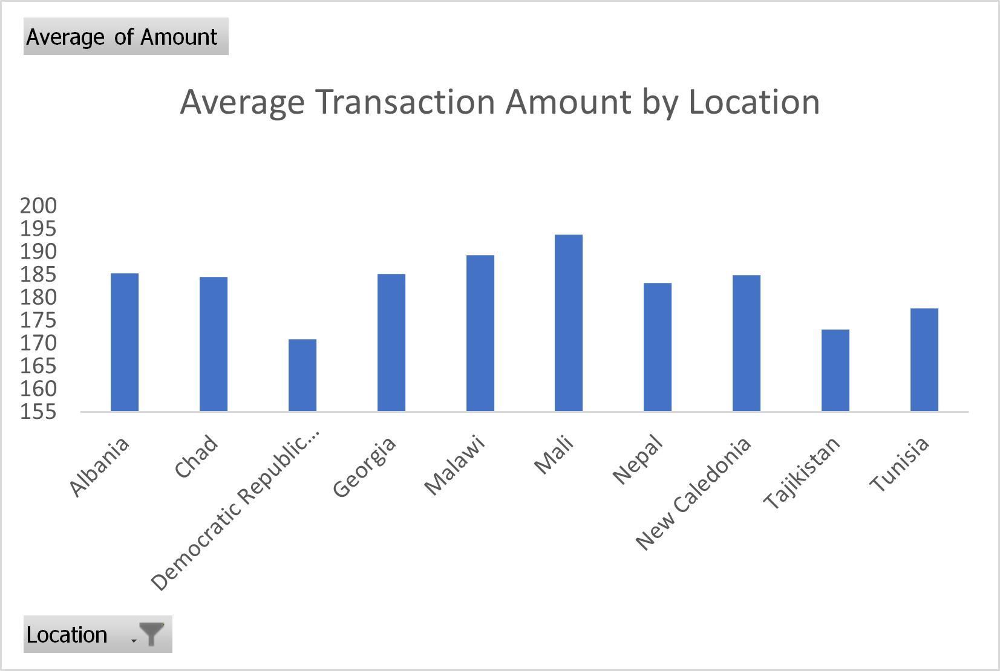

# Crypto Fraud Detection Analysis 

## Introduction

🔍 Explore cryptocurrency transaction data to uncover potential fraud patterns.

This project analyzes blockchain transaction activity using **SQL and data visualization** to identify suspicious behavior across different locations.

The analysis focuses on:

- 🚩 detecting fraud-flagged transactions  
- 🌍 identifying locations with high fraud activity  
- 📊 understanding fraud distribution  
- 💰 analyzing transaction values across regions  

🔎 SQL queries used in this analysis can be found in the **SQL folder** of this repository.

## Background

With the rapid growth of cryptocurrency usage, blockchain networks process large numbers of financial transactions every day. While most of these transactions are legitimate, some may indicate suspicious or fraudulent activity.

This project explores a dataset of **1000 cryptocurrency transactions** to analyze transaction behavior and identify potential fraud patterns using SQL.

The questions I wanted to answer through my SQL analysis were:

1. Which transactions involve unusually **high transfer amounts**?
2. Which wallets are sending **too many transactions**?
3. Which locations report the **highest number of fraud transactions**?
4. Which transactions have **unusually high gas fees**?
5. What **percentage of transactions are fraudulent**?
6. Which wallets receive the **most transactions**?
7. Which locations have the **highest fraud rates**?


## Tools I Used

For this cryptocurrency fraud analysis project, I used the following tools:

**SQL**  
The main tool used to query and analyze the transaction dataset.

**MySQL**  
Used to store the dataset and execute SQL queries efficiently.

**Excel**  
Used to create visualizations from SQL query results.

**Exploratory Data Analysis (EDA)**  
Used to explore the dataset and identify patterns before performing deeper analysis.

**Git & GitHub**  

## The Analysis

Each query in this project investigates different aspects of cryptocurrency transaction behavior and potential fraud patterns.

---

### 1. High-Value Suspicious Transactions

To detect potentially suspicious activity, I filtered transactions with unusually large transfer amounts.

```sql
SELECT
Transaction_id,
Wallet_From,
Wallet_To,
Amount,
Location
FROM crypto_transactions
WHERE Amount > 150
ORDER BY Amount DESC;
```

| Transaction_id | Wallet_From | Wallet_To | Amount | Location  |
| -------------- | ----------- | --------- | ------ | --------- |
| 962            | 0x6AE8C9    | 0x89B35E  | 199.90 | Greece    |
| 552            | 0x96B7E2    | 0xEE630E  | 199.73 | China     |
| 233            | 0xFA94F1    | 0xD18AD3  | 199.72 | China     |
| 381            | 0xEE446A    | 0xFA5639  | 199.53 | Paraguay  |
| 727            | 0xAD9FE3    | 0xCB74A8  | 199.48 | Indonesia |

**Insights**

* Multiple transactions exceed **150 units**, indicating unusually large transfers.
* High-value transactions may represent suspicious financial activity.

---

### 2. Total Transactions by Location

This query identifies regions with the highest cryptocurrency transaction activity.

```sql
SELECT
Location,
COUNT(*) AS Total_Transactions
FROM crypto_transactions
GROUP BY Location
ORDER BY Total_Transactions DESC
LIMIT 10;
```

| Location       | Total_Transactions |
| -------------- | ------------------ |
| China          | 184                |
| Indonesia      | 111                |
| Russia         | 58                 |
| Philippines    | 54                 |
| Brazil         | 44                 |
| Portugal       | 35                 |
| Poland         | 29                 |
| France         | 25                 |
| United States  | 25                 |
| Czech Republic | 25                 |



**Insights**

* **China recorded the highest number of transactions.**
* **Indonesia and Russia** also show significant transaction activity.

---

### 3. Fraud Transactions by Location

This analysis identifies where fraud occurs most frequently.

```sql
SELECT
Location,
COUNT(*) AS Fraud_Count
FROM crypto_transactions
WHERE Flagged = 'TRUE'
GROUP BY Location
ORDER BY Fraud_Count DESC;
```

| Location    | Fraud_Count |
| ----------- | ----------- |
| Indonesia   | 19          |
| China       | 11          |
| Russia      | 10          |
| Brazil      | 8           |
| Poland      | 8           |
| Portugal    | 7           |
| Mexico      | 5           |
| Philippines | 4           |
| Malaysia    | 3           |
| Vietnam     | 3           |



**Insights**

* **Indonesia has the highest number of fraud-flagged transactions.**
* Fraud activity appears concentrated in a few regions.

---

### 4. Highest Gas Fee Transactions

Gas fees represent the processing cost for blockchain transactions. Extremely high gas fees may indicate unusual activity.

```sql
SELECT
Transaction_id,
Wallet_From,
Wallet_To,
Gas_Fee,
Amount,
Location
FROM crypto_transactions
ORDER BY Gas_Fee DESC
LIMIT 10;
```

| Transaction_id | Wallet_From | Wallet_To | Gas_Fee  | Amount | Location      |
| -------------- | ----------- | --------- | -------- | ------ | ------------- |
| 373            | 0xC2D4CB    | 0x740DDA  | 0.002000 | 173.59 | China         |
| 887            | 0xB1A025    | 0x8AEA59  | 0.001994 | 158.04 | United States |
| 999            | 0xD2821C    | 0xBE22E6  | 0.001992 | 123.59 | Colombia      |
| 562            | 0xC7D7EF    | 0x78CF2C  | 0.001990 | 154.00 | Canada        |
| 404            | 0xBB6702    | 0xE7EE4E  | 0.001988 | 137.64 | Uganda        |

**Insights**

* Some transactions show **unusually high gas fees**.
* Monitoring gas fee spikes may help identify abnormal activity.

---

### 5. Overall Fraud Percentage

This query calculates the percentage of transactions flagged as fraudulent.

```sql
SELECT
COUNT(*) AS Total_Transactions,
SUM(CASE WHEN Flagged='TRUE' THEN 1 ELSE 0 END) AS Fraud_Transactions,
ROUND(
SUM(CASE WHEN Flagged='TRUE' THEN 1 ELSE 0 END) * 100 / COUNT(*),
2
) AS Fraud_Percentage
FROM crypto_transactions;
```

| Total_Transactions | Fraud_Transactions | Fraud_Percentage |
| ------------------ | ------------------ | ---------------- |
| 1000               | 108                | 10.8             |



**Insights**

* Approximately **10.8% of transactions were flagged as fraudulent**.
* Even small fraud percentages can represent significant financial risk.

---

### 6. Fraud Rate by Location

This query measures fraud intensity relative to the total number of transactions in each location.

```sql
SELECT
Location,
COUNT(*) AS Total_Transactions,
SUM(CASE WHEN Flagged='TRUE' THEN 1 ELSE 0 END) AS Fraud_Count,
ROUND(
SUM(CASE WHEN Flagged='TRUE' THEN 1 ELSE 0 END) * 100 / COUNT(*),
2
) AS Fraud_Rate_Percent
FROM crypto_transactions
GROUP BY Location
ORDER BY Fraud_Rate_Percent DESC
LIMIT 10;
```



**Insights**

* Fraud risk varies significantly between locations.
* Some regions show **higher fraud rates relative to transaction volume**.

---

### 7. Average Transaction Amount by Location

Finally, I analyzed the average transaction value across locations.

```sql
SELECT
Location,
ROUND(AVG(Amount),2) AS Avg_Transaction_Amount
FROM crypto_transactions
GROUP BY Location
ORDER BY Avg_Transaction_Amount DESC
LIMIT 10;
```



**Insights**

* Some locations show **higher average transaction values**.
* High-value transaction regions may require additional monitoring.

Git and GitHub were used for version control and project sharing. The repository documents the SQL queries, dataset structure, visualizations, and insights derived from the analysis.
